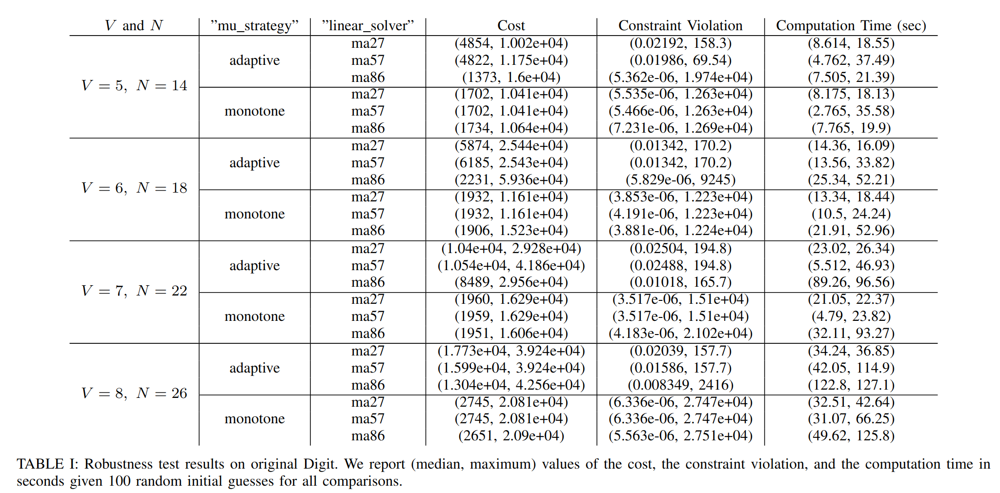

# Gait Optimization For Digit

This folder contains the gait optimization implementation for Digit.

## Getting Started
The executable is compiled as `Digit_example` in the `build/` folder.
Make sure you run it in `build/` otherwise there will be path error.
```bash
cd RAPTOR/build
./Digit_example
```

The desired behavior and Ipopt settings are specified in `singlestep_optimization_settings.yaml`.
Please read it carefully to generate desired gaits.

## Optimization Formulation
The active constraints:
- JointLimits
- TorqueLimits
- RectangleSurfaceContactConstraints (for maintaining ground contact)
- DigitCustomizedConstraints
    - torso height larger than 1 meter (avoid falling)
    - torso roll pitch yaw smaller than [parameter 1] (increase stability of the gait)
    - swing foot on the ground at the beginning and the end of the gait, always above the ground during the gait
    - swing foot height heigher than [parameter 2] in the middle of the gait
    - swing foot position enforced at [parameter 3] and [parameter 4] at the beginning and the end of the gait
    - swing foot roll, pitch, yaw equal to 0 all the time (stays flat with the ground and points forward)
- DigitSingleStepPeriodicityConstraints (optional, for enforcing periodic gaits)

The parameters can be changed in `singlestep_optimization_settings.yaml` in this folder:
- parameter 1: eps_torso_angle
- parameter 2: swingfoot_midstep_z_des
- parameter 3: swingfoot_begin_y_des
- parameter 4: swingfoot_end_y_des
You can find more descriptions in `singlestep_optimization_settings.yaml`.

## Handling Closed-loop Constraints
This paragraph serves as supplementary materials to our paper.

### Closed-loop Chain Constraint Definition & Computation on Digit-v3
Digit-v3 contains multiple closed-loop kinematics chains.
They are defined in the MuJoCo XML format, coming together with Digit-v3's official description file, which can be found in `Robots/digit-v3/digit-v3.xml`.
To be more specific, there are six equality constraints in Digit dynamics:
```html
<equality>
    <connect name='left-leg/achilles-rod' body1='left-leg/heel-spring' body2='left-leg/achilles-rod' anchor='0.113789 -0.011056 0' />
    <connect name='left-leg/toe-a-rod' body1='left-leg/toe-roll' body2='left-leg/toe-a-rod' anchor='0.0179 -0.009551 -0.054164' />
    <connect name='left-leg/toe-b-rod' body1='left-leg/toe-roll' body2='left-leg/toe-b-rod' anchor='-0.0181 -0.009551 -0.054164' />
    <connect name='right-leg/achilles-rod' body1='right-leg/heel-spring' body2='right-leg/achilles-rod' anchor='0.113789 0.011056 0' />
    <connect name='right-leg/toe-a-rod' body1='right-leg/toe-roll' body2='right-leg/toe-a-rod' anchor='0.0179 0.009551 -0.054164' />
    <connect name='right-leg/toe-b-rod' body1='right-leg/toe-roll' body2='right-leg/toe-b-rod' anchor='-0.0181 0.009551 -0.054164' />
  </equality>
```
More details on the equality constraints definition in MuJoCo XML format can be found in MuJoCo's [official documentation](https://mujoco.readthedocs.io/en/latest/XMLreference.html#equality).
But it's basically saying the following two translations should be always enforced to be equal:
```
forward kinematics 1 = root --> body1 --> anchor (offset)
```
```
forward kinematics 2 = root --> body2
```
Here, `anchor` serves as an offset or additional translation attached at the end of the body1.

Note that we perform the following modifications in our implementation:

#### Our modification 1: Simplifying the ball joints
Ball joints are installed inside all closed-loop chains to connect these loops.
They are included in the original MuJoCo description.
For the sake of simplicity, we decide to introduce the minimal degree of freedom to describe the structure, where all ball joints are simplified to two revolute joints installed at the same location.
For example, `left-achilles-rod` is described as ball joint the `digit-v3.xml`.
In `digit-v3-armfixedspecific-springfixed.urdf`, however, we make `left_achilles_rod` as one revolute joint rotating around `z` axis and introduce a new joint called `left_ach2` rotating around `y` axis.
The simplification is equivalent to the original constraint formulation.

As a result, the kinematics tree involved for all closed-loop chains can be summarized as below:

- Left/right knee closed-loop
```
forward kinematics 1 = root --> ... --> hip_pitch --> knee --> shin --> tarsus --> heel_spring --> anchor (offset)
forward kinematics 2 = root --> ... --> hip_pitch --> achilles_rod --> ach2
```

- Left/right toe-A closed loop
```
forward kinematics 1 = root --> ... --> tarsus --> toe_pitch --> toe_roll --> anchor (offset)
forward kinematics 2 = root --> ... --> tarsus --> toe_A --> toe_A_rod --> A2
```

- Left/right toe-B closed loop
```
forward kinematics 1 = root --> ... --> tarsus --> toe_pitch --> toe_roll --> anchor (offset)
forward kinematics 2 = root --> ... --> tarsus --> toe_B --> toe_B_rod --> B2
```

#### Our modification 2: Fixing the springs
It is treated one of the basic assumptions in our paper that all springs (`left/right-shin` and `left/right-heel-spring`) are rigid and thus fixed (joint angle fixed at 0).
Hence, the kinematics tree above can be simplified.

One small issue is in left/right knee closed-loop.
Note that we need to compute `tarsus --> heel_spring --> anchor (offset)`.
However, if we fix `heel_spring` in the urdf, the urdf parser in pinocchio will automatically merge this body to the parent and hence we not able to access this joint anymore.
As a result, we manually perform the forward kinematics by merging the transformation matrix of `heel_spring` into the original `anchor (offset)`.
To be more specific, the new anchor definition can be found in line 185-187 and line 196-198 in `include/DigitDynamicsConstraints.h`.
For example, 
```C++
Transform(Utils::deg2rad(Vec3(4.47, 0.32, 155.8)), 
          Vec3(-0.01766, -0.029456, 0.00104))
```
is the transformation matrix for left_heel_spring and
```C++
Transform(Vec3(0.113789, -0.011056, 0))
```
is the original anchor.
All these numbers can be found and verified in `digit-v3.xml`.

You can check how we implement constraints using [pinocchio::RigidConstraintModel](https://github.com/stack-of-tasks/pinocchio/blob/master/include/pinocchio/algorithm/contact-info.hpp) in line 95-209 in `python/digit_simulation.py`.

#### Our modification 3: You don't have to start from the root of the kinematics tree
The computation of the kinematics constraints are equivalent if we ignore the common parts existing in both kinematics routes.
For example, we can actually just compute the following
- Left/right knee closed-loop
```
forward kinematics 1 = hip_pitch --> knee --> shin --> tarsus --> heel_spring --> anchor (offset)
forward kinematics 2 = hip_pitch --> achilles_rod --> ach2
```

- Left/right toe-A closed loop
```
forward kinematics 1 = tarsus --> toe_pitch --> toe_roll --> anchor (offset)
forward kinematics 2 = tarsus --> toe_A --> toe_A_rod --> A2
```

- Left/right toe-B closed loop
```
forward kinematics 1 = tarsus --> toe_pitch --> toe_roll --> anchor (offset)
forward kinematics 2 = tarsus --> toe_B --> toe_B_rod --> B2
```

which avoids the forward kinematics computation of a bunch of joints.
However, the forward kinematics in pinocchio can only provide results starting from the root of the robot, which is partially why we develop our own forward kinematics implementation.

You can find how we implement this in line 461-537 in `src/DigitDynamicsConstraints_clean.cpp`.

#### Our modification 4: Compute everything symbolically
However, you will find that we are not actually using `src/DigitDynamicsConstraints_clean.cpp`.
Note that by modification 3, the kinematics trees involved in the closed-loop chain are already not that deep.
We found that the computation could be much faster if we simply dump the above forward kinematics computation into [Matlab Symbolic Toolbox](https://www.mathworks.com/products/symbolic.html) and export the symbolic expressions to C code using [ccode](https://www.mathworks.com/discovery/matlab-code.html).
The symbolic toolbox is able to simplify the expressions and thus introduce less numeric operations.
The code that we are actually using in `src/DigitDynamicsConstraints.cpp` contains the code exported from the symbolic toolbox.
We use it not only for the constraints, but also for the higher-order derivatives of the constraints, which also turn out to be much faster than computing plain forward kinematics derivatives.

### Solving The Inverse Kinematics
To get the unactuated joint states, we have to solve an inverse kinematics problem to find the corresponding unactuated joint states that satisfy the constraints given actuated joint states.
We use the [multi root finding](https://www.gnu.org/software/gsl/doc/html/multiroots.html) functions implemented in GSL.
There are several lessons we learn from implementing this:

#### Lesson 1: The problem may not have a solution
The inverse kinematics may not have a solution for all actuated joint positions within the limits, in other words:
- The problem may not have a solution at all.
- The problem has a solution but it is outside the unactuated joint limits.
As a result, it is important to warm up the root finding process with a proper initial guess.

#### Lesson 2: Initial guess by interpolating offline solutions using trigonometric polynomials
Note that the number of actuated joints involved in closed-loop chains is not large (1 for knee loops, 2 for toe loops).
As a result, we can sample a bunch of points within the actuated joint limits and solve the problem offline first.
We then collect the data and interpolate them using trigonometric polynomials.
To be more specific, the interpolation looks like
```math
sin(q_u) = \sum_{1 \leq i \leq j \leq n} \sin(i q_a) \cos(j q_a)
```
inspired by the trigonometric nature of the forward kinematics (of the robot with only revolute joints).
$q_u$ can then be computed by $\arcsin$.
And as a result, if interpolation values are larger than 1 or smaller than -1, the problem is (very likely) infeasible.

#### Lesson 3: Properly limit the actuated joint angles
As you can see in `include/DigitConstants.h`, where we store all the joint limits and torque limits extracted from `digit-v3.xml`, we changed the joint limits for actuated joints involved in the closed-loops.
As we have described in previous two points, the problem is not feasible for all actuated joint angles.
But note that the problem is usually feasible in those regular walking gaits, since this is how the robot should have been designed.
However, although starting inside a feasible region, the optimization process might update the decision variable towards the infeasible region (maybe because we are tring to make robot do something really aggressive, for example, step forward for too long), thus leading to the failure of the evaluation of the inverse kinematics.
To solve this problem, we manually shrink the actuated joint limits to stay away from inverse kinematics infeasible region.
This region is decided by the previous point, by overapproximating based on the uniformly sampled points where the problem is verified to be feasible offline.

#### Lesson 4: Initial guess
Finally, the initial guess of the optimization needs to be chosen carefully so that all joint angles on the initial trajectory stays inside the feasible region.
As you can see in `DigitSingleStep.cpp`:
```C++
Eigen::VectorXd z = 0.2 * Eigen::VectorXd::Random((degree + 1) * NUM_INDEPENDENT_JOINTS + NUM_JOINTS + NUM_DEPENDENT_JOINTS).array() - 0.1;
```
Randomly sampling from $[-0.1, 0.1]$ for all decision variables (in other words, Bezier coefficients) would be enough.
Our method is robust towards random initial guess since the optimization will still converge in most cases (more quantitative discussion later).

## Ablation Studies on Hyperparameters
We performed ablation studies on the degree of the Bezier curve, the number of time nodes to evaluate constraints, and other Ipopt parameters.

The initial guesses are assigned by randomly sampling from $[-0.1, 0.1]$ for all decision variables.
The maximum number of iterations of Ipopt is set to 100.

We report the (median, maximum) of the final cost function value, the final constration violation, and the total computation time.



`adaptive` mu strategy and HSL MA57 as the linear solver would be sufficient for general problems.
HSL MA86 usually brings better convergence performance, but takes longer time.